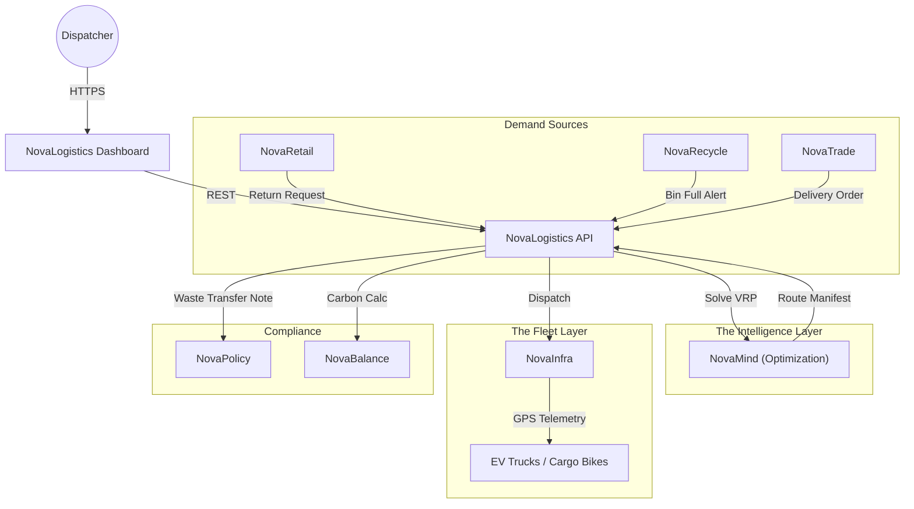

# 🚛 NovaLogistics

> **The Operating System for Circular Transport.**
> Optimization engine for reverse logistics, fleet management, and sustainable supply chain coordination.

[](https://www.google.com/search?q=https://github.com/novaeco-tech/novalogistics/actions)
[](https://opensource.org/licenses/MIT)
[](https://www.google.com/search?q=https://logistics.novaeco.tech)

**NovaLogistics** (formerly NovaMobility) is the Horizontal Enabler responsible for **Movement**. In a linear economy, logistics is simple: Factory $\rightarrow$ Consumer. In a Circular Economy, logistics is complex: Consumer $\rightarrow$ Repair $\rightarrow$ User $\rightarrow$ Recycler.

It provides the routing algorithms, fleet orchestration, and label generation required to close the loop physically. It integrates with `NovaRecycle` for waste collection and `NovaRetail` for product returns.

-----

## 🎯 Value Proposition

The cost of "Reverse Logistics" is often the barrier to recycling. **NovaLogistics** drives this cost down via efficiency:

1.  **The "Empty Mile" Killer:** Algorithms that fill empty delivery trucks with return items or waste for the return trip ("Backhauling").
2.  **Dynamic Routing:** Instead of static weekly trash pickups, routes are generated daily based on real-time bin sensor data from `NovaInfra`.
3.  **Modal Shift:** Prioritizing low-carbon transport (Cargo Bikes, EV Vans, Rail) for urban last-mile operations to meet Low Emission Zone standards.

-----

## 🏗️ Architecture (The Routing Engine)

NovaLogistics acts as a **Vehicle Routing Problem (VRP)** solver. It aggregates demand from all sectors and assigns it to available fleets.



### Integrated Services

  * **[NovaMind](https://www.google.com/search?q=https://mind.novaeco.tech):** The mathematician. Solves the NP-Hard "Traveling Salesman Problem" with constraints (Battery range, Vehicle capacity, Time windows).
  * **[NovaInfra](https://www.google.com/search?q=https://infrastructure.novaeco.tech):** The fleet manager. Tracks real-time GPS locations and battery levels of the vehicles.
  * **[NovaPolicy](https://www.google.com/search?q=https://compliance.novaeco.tech):** The regulator. Generates the mandatory **Digital Waste Transfer Note (dWTN)** if a vehicle is carrying hazardous waste (e.g., Li-Ion batteries).
  * **[NovaBalance](https://www.google.com/search?q=https://balance.novaeco.tech):** The auditor. Calculates the exact Scope 3 Transport Emissions per km for every parcel moved.

-----

## ✨ Key Features

### 1\. Unified Reverse Logistics

One API for all "Take-Back" scenarios.

  * **Consumer:** Generates QR code labels for printer-less returns at drop-off points (`NovaRetail`).
  * **Industrial:** Coordinates pallet pickups for reusable crates (`NovaPack`).
  * **Municipal:** Schedules bulk waste pickup for overflowing smart bins (`NovaRecycle`).

### 2\. The "Milk Run" Optimizer

Orchestrates multi-stop loops to maximize vehicle utilization.

  * **Logic:** "Drop off refurbished phone at User A $\rightarrow$ Pick up old textile at User B $\rightarrow$ Drop off compost at Farm C $\rightarrow$ Return to Hub."
  * **Result:** 40% reduction in vehicle kilometers traveled (VKT).

### 3\. Hazardous Material Routing

Specialized logic for `NovaChem` and `NovaTronix`.

  * Ensures vehicles carrying dangerous goods (ADR) avoid restricted tunnels or dense residential zones.
  * Verifies that the driver holds the correct `NovaSkills` certification for HazMat transport.

### 4\. Smart Label Generation

Dynamic shipping labels.

  * **Standard:** carrier-compliant barcodes (DHL, FedEx, UPS integration).
  * **Circular:** QR codes containing the `NovaMaterial` Passport ID, allowing the receiving facility to instantly know *what* is in the box before opening it.

-----

## 🚀 Getting Started

We use **DevContainers** to provide a consistent development environment.

### Prerequisites

  * Docker Desktop
  * VS Code (with Remote Containers extension)
  * Google Maps API Key (or Mapbox) for geocoding services.

### Installation

1.  **Clone the repo:**
    ```bash
    git clone https://github.com/novaeco-tech/novalogistics.git
    cd novalogistics
    ```
2.  **Open in VS Code:**
      * Run `code .`
      * Click **"Reopen in Container"** when prompted.
3.  **Start the Enabler:**
    ```bash
    make dev
    ```
      * **Dispatch Map:** http://localhost:3000
      * **API:** http://localhost:8000/docs

### Configuration (`.env`)

```ini
# Routing Engine
SOLVER_TIMEOUT_SEC=30
MAP_PROVIDER=OSM # or GOOGLE, MAPBOX

# Integrations
NOVAINFRA_URL=http://novainfra-api:8000
NOVAMIND_URL=http://novamind-api:50051
```

-----

## 📂 Repository Structure

This is a Monorepo containing the enabler's specific logic.

```text
novalogistics/
├── api/                # Python/FastAPI (Domain Logic)
│   ├── src/
│   │   ├── vrp/        # OR-Tools / Vroom optimization wrappers
│   │   ├── labels/     # PDF generator for shipping labels
│   │   └── tracking/   # State machine for shipments
├── app/                # React/Mapbox Frontend (Dispatch UI)
│   ├── src/
│   │   ├── map/        # Live fleet visualization
│   │   └── routes/     # Drag-and-drop route planner
├── website/            # Documentation (Docusaurus)
└── tests/              # Integration tests
```

-----

## 🧪 Testing

We use **Scenario Simulation** for testing.

  * **VRP Solver Test:** `make test-solver`
      * Inputs: 5 Trucks, 50 Stops, 8-hour shift.
      * Asserts: All stops visited, no overtime, battery limits respected.
  * **Label Test:** `make test-label`
      * Generates a sample PDF label and verifies the barcode is readable and contains the correct tracking UUID.

-----

## 🤝 Contributing

We need contributors with backgrounds in **Operations Research**, **GIS**, and **Last-Mile Logistics**.
See [CONTRIBUTING.md](https://www.google.com/search?q=../.github/CONTRIBUTING.md) for details.

**Maintainers:** `@novaeco-tech/maintainers-enabler-novalogistics`